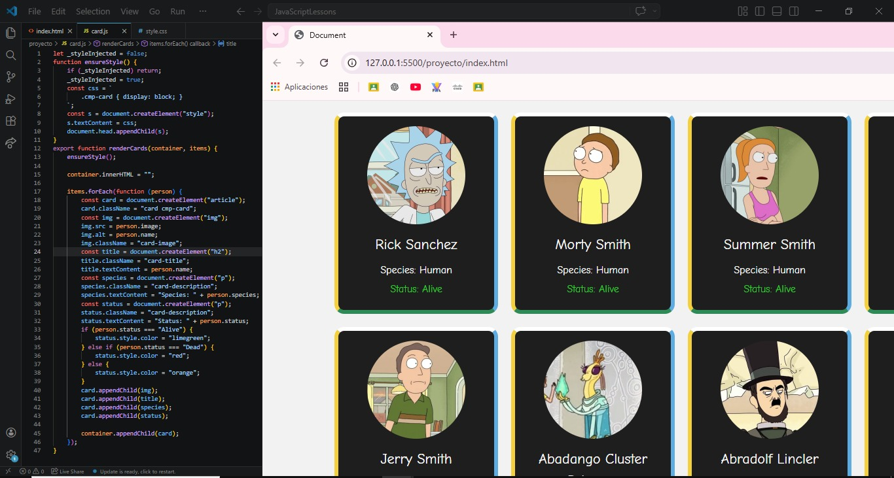

##apuntes clase 6

Ignacio Alex Escobar Vasquez
Ing. Sistemas
###ramas y lo importante de la bifurcacion:
ramas : son una bifurcacion de estado del codigo, que crea
un nuevo camino del codigo, la bifurcacion de la rama 
principal pue
El auxi dio un ej grafico , dando trabajamos en la rama main
permite trabajar en equipo donde cada persona pueda trabajar
en su propio codigo sin la necesidad de que choquen
con el comando git branch , va listar todas las ramas que
tenemos y visualmente nos muestra en que rama nos encontramos
para crear una rama usamos git branch nombreRama, el cual se
crea a partir de main y tiene todo el codigo de la rama main,
para borrar una rama: git branch D nombreRama.
Que es origen head?
es donde esta la cabecera del origen
git checkout para cambiar de rama,y tambien 
git checkout -b nombreRama te crea la rama y te cambia directamente a esa rama
usando git switch creas la rama y te cambia tambien
###casos que considerar:
cuando tenemos algo en staged y tenemos
queremos cambiar el punto es que no nos deja cambiar
de rama, a lo que entendi eso.
###buenas practicas en este contexto de las ramas pues:
 usar flujos de trabajo(git flow)
trabajar con ramas de manera correcta, 
git flow consiste en main codigo de prouccion,
develop sacar versiones estables que se puedan conectar con main
usar feature y nombre rama aqui es donde s trabajan las modificaciones
para cada funcionalidad nueva.

Justificacion del porque no asisti a esta clase:
Bueno el dia lunes tenia que defender un proyecto que llebava tiempo haciendo para unos cursos de javascript,
el punto es que el dia de la defensa caia en los horarios de 20:30 pm a 22:30 pm y no podia faltar a esa defensa
porque era gran parte de la nota de esos cursos defender mi proyecto 

evidencia visual del codigo de lo que defendi:

